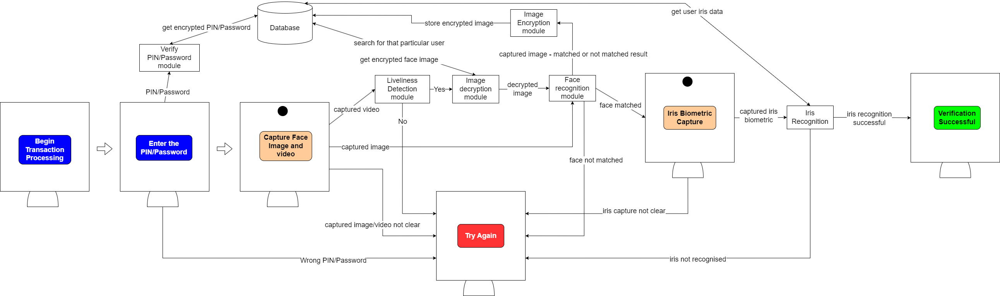
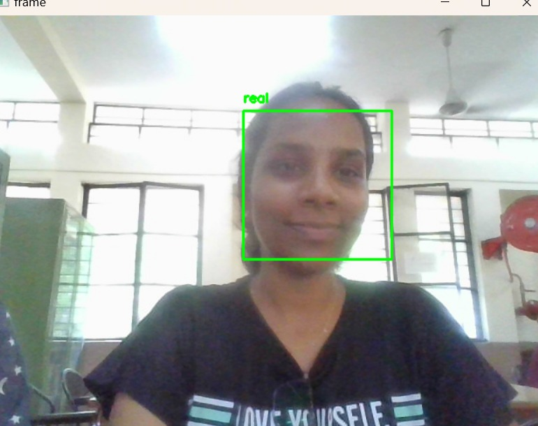
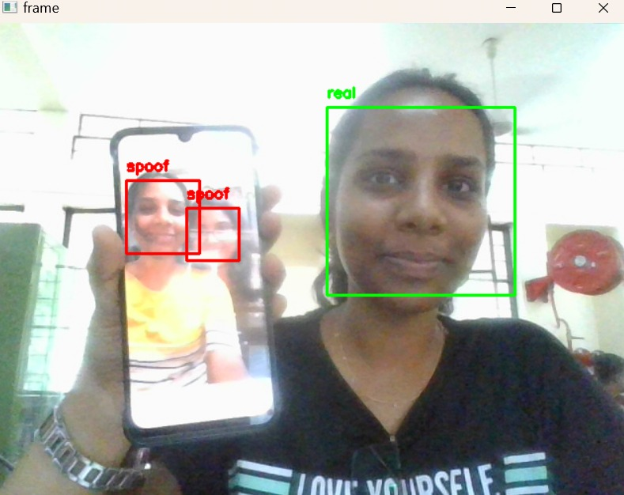
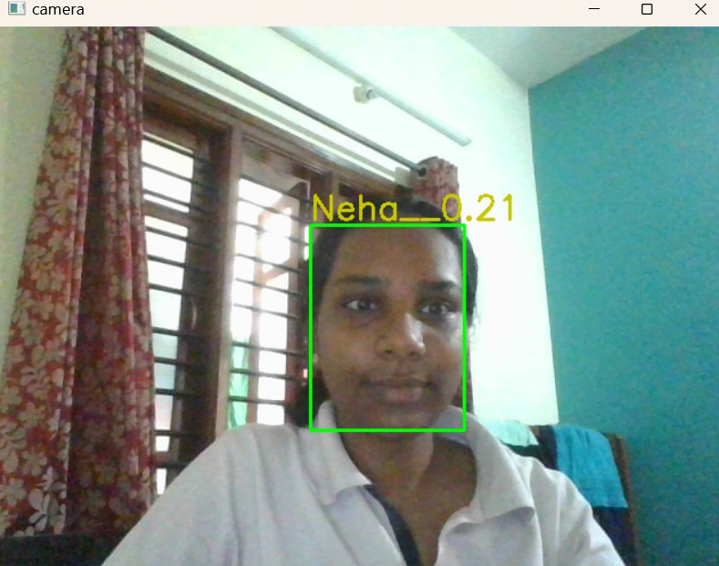

# Facial Recognition for Transactions and OTP - American Express Hackathon
The project is aimed at enhancing the security of financial transactions and online authentication by using facial recognition technology.
With the increasing prevalence of online transactions and the need for secure authentication methods, traditional methods such as passwords and two-factor authentication (2FA) are no longer sufficient. Facial recognition offers a more secure and convenient alternative by using biometric data that is unique to each individual.
This project utilizes facial recognition algorithms to verify the identity of the user during online transactions or when logging in to a secure account. 

The developed system has three-factor authentication:
1) Using Password : Passwords provide a basic level of security and privacy by restricting access to sensitive information or resources to only authorized individuals, thereby helping to prevent unauthorized access and potential data breaches.
2) Using facial recognition : The system captures an image of the user's face and compares it to a stored image in the system. If the images match, the transaction is approved or the user is granted access to their account. 
3) Using iris recognition : The system provides another level of transaction verification by incorporating an iris recognition system.

# Frameworks and TechStack used:
1) Python 
2) MobileNetV2
3) FaceNet
4) MTCNN
5) DenseNet
6) Flask
7) Streamlit

# Description of the TechStack:

MobileNet is a deep neural network architecture designed for efficient computation on mobile devices and other low-power devices. The main idea behind MobileNet is to use depthwise separable convolutions to reduce the number of computations required during the forward pass of the network. Depthwise separable convolutions consist of two separate convolutional layers.

The MTCNN model is used to detect and align faces in an image or video frame. Once the faces are aligned, the FaceNet model is then used to generate a high-dimensional embedding for each face, which can be compared to other embeddings to determine whether they belong to the same person or not. By combining these two models, the face recognition system is able to accurately identify individuals even under varying conditions such as different poses, lighting, or facial expressions.

DenseNet has been used for iris recognition.  The architecture is adapted to accept iris images as input. The iris images are then preprocessed to enhance the iris pattern and normalize the lighting and contrast. Then, the DenseNet model is trained to learn a high-dimensional embedding for each iris image. During the training process, the model has been optimized to minimize the distance between embeddings of the same iris and maximize the distance between embeddings of different irises. The trained model is then used to generate embeddings for new iris images and compare them to a database of previously enrolled iris images for verification or identification. 

Flask is a lightweight and flexible web application framework for Python. It is designed to be easy to use and can be used to build a variety of web applications, from simple web services to complex web applications. Flask provides a set of tools and libraries for building web applications, including a routing system, template engine, and support for handling HTTP requests and responses. Flask is also highly customizable, allowing developers to add additional functionality using a variety of extensions and plugins. 

Streamlit provides a simple and intuitive interface for creating user interfaces, allowing developers to focus on their data and analysis rather than the technical details of web development. Streamlit includes a variety of features and widgets, such as sliders, dropdowns, and plots, that can be easily integrated into data-driven applications.

# Architectural Diagram of the proposed model

# Installation and Usage

# Face Liveliness Detection
# Face recognition
# Iris Recognition

# Results
Home Page:

Liveliness Detection:

Face Recognition:

Iris Recognition:

